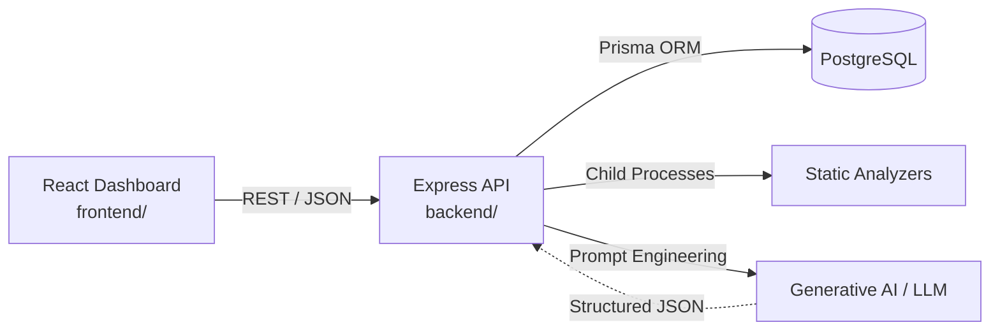
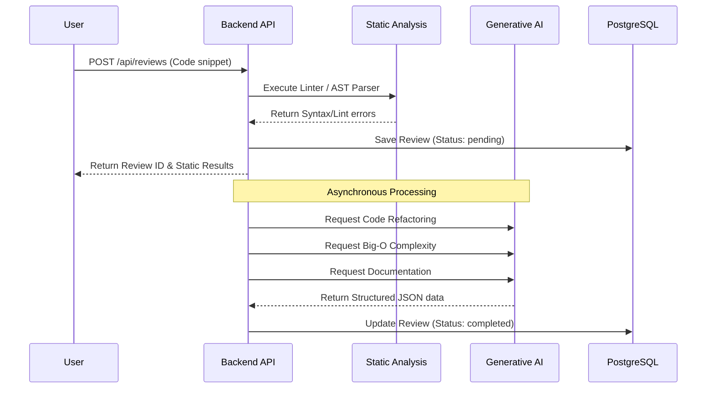
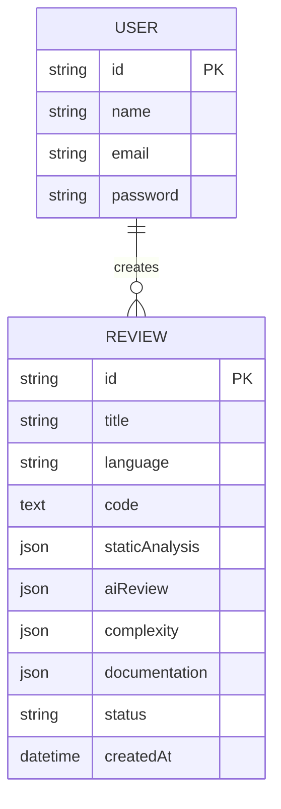

<h1 align="center">🚀 AI Code Review Assistant</h1>

<p align="center">
  
</p>

<p align="center">
  A secure, full-stack web application that serves as a next-generation AI-powered code analysis platform. It combines blazing-fast static analysis with deep learning generative AI to provide developers with real-time feedback on bugs, complexity, and architectural smells.
</p>

<p align="center">
  <a href="#"></a>
  <a href="#"></a>
  <a href="#"></a>
  <a href="#"></a>
  <a href="#"></a>
</p>

## Tech Stack Icons

<table align="center">
  <tr>
    <td align="center" width="130">
      <br />
      <strong>React</strong>
    </td>
    <td align="center" width="130">
      <br />
      <strong>Node.js</strong>
    </td>
    <td align="center" width="130">
      <br />
      <strong>Express.js</strong>
    </td>
    <td align="center" width="130">
      <br />
      <strong>PostgreSQL</strong>
    </td>
  </tr>
  <tr>
    <td align="center" width="130">
      <br />
      <strong>Tailwind CSS</strong>
    </td>
    <td align="center" width="130">
      <br />
      <strong>Generative AI</strong>
    </td>
    <td align="center" width="130">
      <br />
      <strong>Prisma ORM</strong>
    </td>
    <td align="center" width="130">
      <br />
      <strong>ESLint</strong>
    </td>
  </tr>
</table>

## Documentation Index

- [1. Executive Summary](#1-executive-summary)
- [2. Product Scope and Capabilities](#2-product-scope-and-capabilities)
- [3. Architecture and System Design](#3-architecture-and-system-design)
- [4. Technology Stack and Versions](#4-technology-stack-and-versions)
- [5. Domain Model and Data Schema](#5-domain-model-and-data-schema)
- [6. Real-World Use Cases](#6-real-world-use-cases)
- [7. Core Problems Solved](#7-core-problems-solved)
- [8. API Reference & Endpoints](#8-api-reference--endpoints)
- [9. Local Development Setup](#9-local-development-setup)
- [10. Repository Layout](#10-repository-layout)

---

## 1. Executive Summary

**Project Aim**: To build a production-ready, highly interactive AI-assisted code review platform that mimics enterprise-grade developer tools. This project acts as a senior engineer pair-programmer, intelligently analyzing source code, rendering complexity graphs, identifying vulnerabilities, and automatically generating pristine documentation.

### At a Glance

| Item | Value |
|---|---|
| Frontend | React 18 + Vite + Tailwind CSS (`frontend/`) |
| Backend API | Node.js + Express (`backend/`) |
| Database | PostgreSQL |
| Core Libraries | Monaco Editor, Prisma ORM, Recharts, JWT |
| Architecture | Monorepo structured with separate frontend and backend workspaces |

---

## 2. Product Scope and Capabilities

The platform serves **Software Engineers** and **Development Teams** looking to automate and standardize code quality checks.

### 🌟 Key Codebase Features
- **Dual-Engine Analysis**: Deterministic static linting running concurrently with intelligent generative AI reviews.
- **Multi-Language Support**: Fully supports 10+ languages including `JavaScript`, `TypeScript`, `Python`, `Java`, `C++`, `Go`, `Rust`, and `PHP`.
- **Advanced Complexity Metrics**: Automatically calculates cyclomatic complexity, Halstead metrics, and Big-O Time/Space complexity with interactive charts.
- **Auto-Documentation Generation**: Automatically generates standard JSDoc/TSDoc/Google-style docstrings for any pasted snippet.
- **Progressive UI & Streaming**: The frontend utilizes a concurrent polling mechanism to unlock analysis tabs progressively as the backend processing completes.
- **Interactive Mobile Support**: Includes a unified `monacoTouch.js` utility enabling native-like single-finger panning and two-finger pinch zooming within the Monaco editor on mobile devices.

#### 🔍 Deep-Dive: Progressive UI & Asynchronous Processing
- **Decoupled Backend Execution**: When a user submits a review, the backend immediately executes fast static analysis and persists the preliminary record, responding quickly. Heavy generative AI tasks (Doc Generation, Big-O Analysis, Refactoring) are farmed out to asynchronous promises.
- **Smart Frontend Polling**: The React frontend leverages intelligent state management to poll the API. As distinct AI modules finish processing in the background, their respective UI tabs (like "Complexity" or "Documentation") transition from a "processing" skeleton loader to a fully interactive view.
- **Graceful Error Handling**: If an external LLM provider times out, the backend meticulously updates individual module statuses to `failed`, allowing the user to seamlessly retry specific failed modules (e.g., just the Refactoring tab) without re-running the entire expensive analysis.

#### 🔍 Deep-Dive: Enterprise-Grade Auth & Security
- **Stateless JWT Rotation**: The platform utilizes a strictly HttpOnly, Secure cookie-based architecture. Access tokens (short-lived) and Refresh tokens (long-lived) are securely issued by the backend.
- **XSS and CSRF Protection**: Because the tokens are never accessible via `document.cookie` in JavaScript, the application is fundamentally protected against Cross-Site Scripting (XSS) token theft. 
- **Automated Axios Interceptors**: The frontend network layer is heavily customized. If an API request returns a `401 Unauthorized`, an Axios interceptor automatically pauses the queue, requests a new access token using the HttpOnly refresh token, and replays the failed requests seamlessly without the user noticing.

#### 🔍 Deep-Dive: Interactive Monaco Editor Integration
- **Custom Touch Interactions**: Mobile code editing is historically painful. We bypassed default Monaco touch events by writing a custom DOM interaction layer (`setupMonacoTouch`) that intercepts raw `touchstart` and `touchmove` events, allowing for smooth native-like scrolling and precise pinch-to-zoom scaling via `editor.updateOptions({ fontSize })`.
- **Intelligent Read-Only Views**: When displaying AI-generated refactored code, the editor dynamically locks into read-only mode, applies targeted line highlighting for identified bugs, and syncs word-wrapping based on viewport width.

#### 🔍 Deep-Dive: Dual-Engine Analysis Engine (AST + LLM)
- **Deterministic Baseline**: Before hitting expensive AI APIs, the backend utilizes built-in AST parsers (like ESLint for JS or Pylint via child processes for Python) to immediately flag syntax errors and standard stylistic violations.
- **Generative AI Structuring**: The backend orchestrates highly structured prompts requesting raw JSON output from the LLM. It utilizes fallback parsing libraries (`jsonrepair`) to guarantee that the LLM's response is safely destructured into UI-ready components (e.g., arrays of specific code smells or precise Big-O notation strings).

---

## 3. Architecture and System Design

### 3.1 System Context



### 3.2 End-to-End Analysis Flow



---

## 4. Technology Stack and Versions

### 4.1 Backend Engine

| Layer | Technology |
|---|---|
| Runtime | Node.js |
| Framework | Express.js |
| Auth & Security | JWT, Bcrypt |
| Database Layer | Prisma ORM |
| Database | PostgreSQL |
| AI Integration | @google/generative-ai |

### 4.2 Frontend Client

| Layer | Package |
|---|---|
| Framework | React (Vite) |
| Styling | Tailwind CSS |
| Code Editor | @monaco-editor/react |
| Data Vis | Recharts |

---

## 5. Domain Model and Data Schema

### 5.1 Core Entities
- **Users**: Authentication details (bcrypt hashed passwords) and profiles.
- **Reviews**: The primary entity storing the raw code snippet, language, overarching status (`pending`, `completed`), and the unified results of the analysis.
- **ReviewModules**: JSON fields attached to the review storing the distinct outputs of the AI (e.g., the generated docstrings, the refactored code, the complexity metrics).

### 5.2 ER Diagram Reference



---

## 6. Real-World Use Cases

1. **Pull Request Automation**: Rapidly pasting complex PR code to find hidden bugs or performance issues before merging.
2. **Legacy Code Modernization**: Feeding old, undocumented legacy code into the platform to automatically generate modern docstrings and structural refactoring advice.
3. **Algorithm Optimization**: Using the Big-O Time and Space complexity charts to visualize algorithmic inefficiencies and discover O(1) or O(log n) alternatives.
4. **Learning & Mentorship**: Junior developers utilizing the platform to understand *why* their code is flawed through detailed, conversational AI explanations.

---

## 7. Core Problems Solved

- **Human Error & Fatigue**: Catches edge-case bugs and security vulnerabilities that tired human reviewers often miss.
- **Context Switching**: Eliminates the need to switch between an IDE, a linter, a documentation generator, and a browser to perform a comprehensive code review.
- **Technical Debt Visualization**: The complexity dashboard provides immediate, visual proof of overly complex functions (cyclomatic complexity) that require refactoring.

---

## 8. API Reference & Endpoints

The platform features a secure, RESTful API architecture protected by stateless JWT rotation.

<details>
<summary><strong>🔐 Authentication Endpoints</strong></summary>

<br>

| Method | Endpoint | Description | Auth Required |
| :--- | :--- | :--- | :---: |
| <kbd>POST</kbd> | `/api/auth/register` | Registers a new developer account. | ❌ |
| <kbd>POST</kbd> | `/api/auth/login` | Authenticates and returns HttpOnly cookies. | ❌ |
| <kbd>POST</kbd> | `/api/auth/logout` | Clears all session cookies securely. | ❌ |
| <kbd>GET</kbd>  | `/api/auth/me` | Retrieves the currently authenticated user's profile. | 🔒 |

</details>

<details>
<summary><strong>🧠 Code Review Endpoints</strong></summary>

<br>

| Method | Endpoint | Description | Auth Required |
| :--- | :--- | :--- | :---: |
| <kbd>POST</kbd> | `/api/reviews` | Submits a new code snippet for full AI analysis. | 🔒 |
| <kbd>GET</kbd>  | `/api/reviews` | Fetches a paginated list of all past reviews. | 🔒 |
| <kbd>GET</kbd>  | `/api/reviews/:id` | Retrieves deep metrics and AI outputs for a specific review. | 🔒 |
| <kbd>DELETE</kbd>| `/api/reviews/:id` | Permanently deletes a review and its metrics from the database. | 🔒 |
| <kbd>POST</kbd> | `/api/reviews/:id/retry` | Forces a background retry for failed AI modules (e.g., Refactoring). | 🔒 |

</details>

<details>
<summary><strong>🌐 Status & System Endpoints</strong></summary>

<br>

| Method | Endpoint | Description | Auth Required |
| :--- | :--- | :--- | :---: |
| <kbd>GET</kbd> | `/api/health` | Retrieves the system's operational health status. | ❌ |
| <kbd>GET</kbd> | `/api/metrics` | Retrieves Prometheus-compatible server metrics. | 🔒 |

</details>

---

## 9. Local Development Setup

### 9.1 Prerequisites
- Node.js (v18+)
- PostgreSQL installed and running locally (or via Docker)
- Git
- API Key from Google Gemini or OpenRouter

### 9.2 Database Setup
Update the `.env` file in the backend directory with your `DATABASE_URL`.
```bash
cd backend
npm install
npx prisma generate
npx prisma db push
```

### 9.3 Run Backend
```bash
cd backend
npm run dev
```

### 9.4 Run Frontend
```bash
cd frontend
npm install
npm run dev
```
Navigate to `http://localhost:5173`.

---

## 10. Repository Layout

```text
ai-code-review-assistant/
|- README.md                    # Root documentation (You are here)
|- backend/                     # Node.js + Express API
|  |- prisma/                   # Schema & Migrations
|  |- src/
|  |  |- server.js              # Entry point
|  |  |- controllers/           # API request handlers
|  |  |- middleware/            # JWT, Auth, Error handlers
|  |  |- services/              # AI Engine, Static Analysis logic
|  |  |- routes/                # Express router definitions
|  |- package.json
|- frontend/                    # React + Vite application
|  |- public/                   # Static assets
|  |- src/
|  |  |- App.jsx                # Root component and Routing
|  |  |- components/            # Shared UI components (Layout, Loaders)
|  |  |- pages/                 # Dashboard, ReviewDetail, Auth pages
|  |  |- hooks/                 # Custom React hooks
|  |  |- utils/                 # Touch controls, Code formatters
|  |  |- index.css              # Global styles & Tailwind
|  |- package.json
```
